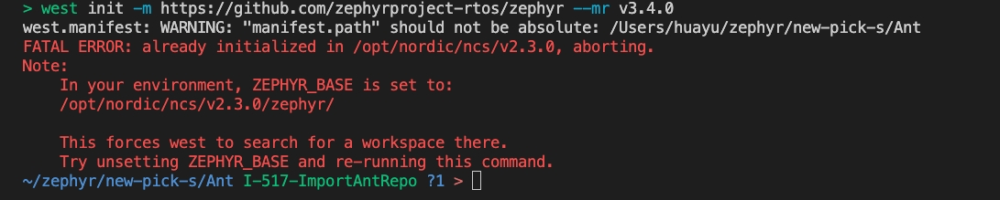

# 🌚 Azure DevOps

> 新产品部项目目前使用`west`进行模块管理，4个机器人仓库各项版本暂未完全统一

## Zephyr

```sh
> source ~/zephyrproject/.venv/bin/activate # activate zephyrproject
> deactivate
```

1.  配置项目环境

    1. 建立新的`new-pick-s`工程管理区，以下简称<mark style="color:yellow;">S目录</mark>，并部署`west`环境，例如：`west init -m https://github.com/zephyrproject-rtos/zephyr --mr v3.4.0`
    2. 在S目录下`clone`仓库之后，将`west.yml`文件内的参数更新为对应仓库，即可进行针对该仓库的模块更新`west update`，参照下一步骤
    3. 编辑`.west/config`，以Ant工程为例

    <pre class="language-yaml"><code class="lang-yaml"><strong>    [manifest]
    </strong>    path = Ant
        file = west.yml

        [zephyr]
        base = zephyr
    </code></pre>
2. 在S目录下编译项目：`west build -p -b p2201 Ant/application`

## 常见问题及解决方式

### zephyr SDK版本不支持

> [https://docs.zephyrproject.org/latest/develop/getting\_started/index.html#install-the-zephyr-sdk](https://docs.zephyrproject.org/latest/develop/getting\_started/index.html#install-the-zephyr-sdk)

* 按照官方教程安装对应版本的SDK，如需删除已安装的SDK，直接将安装目录删除即可

### python模块找不到

> [https://docs.zephyrproject.org/latest/develop/getting\_started/index.html#get-zephyr-and-install-python-dependencies](https://docs.zephyrproject.org/latest/develop/getting\_started/index.html#get-zephyr-and-install-python-dependencies)

* 检查当前python环境是否正确，如安装在虚拟环境，检查是否已激活对应的虚拟环境
* 运行`pip3 install -r ~/zephyrproject/zephyr/scripts/requirements.txt`安装依赖项

### west config检查

```sh
> west config -l
manifest.path=Ant
manifest.file=west.yml
zephyr.base=zephyr

> west manifest --path
/Users/huayu/zephyr/new-pick-s/Ant/west.yml

# 修改manifest路径，不建议使用，请直接在.west/config文件中进行修改
> west config manifest.path Ant 
```

### `west init`报错

<figure><figcaption></figcaption></figure>

* 删除`ZEPHYR_BASE`路径配置或将其更改至想要运行`west init`指令的路径下
