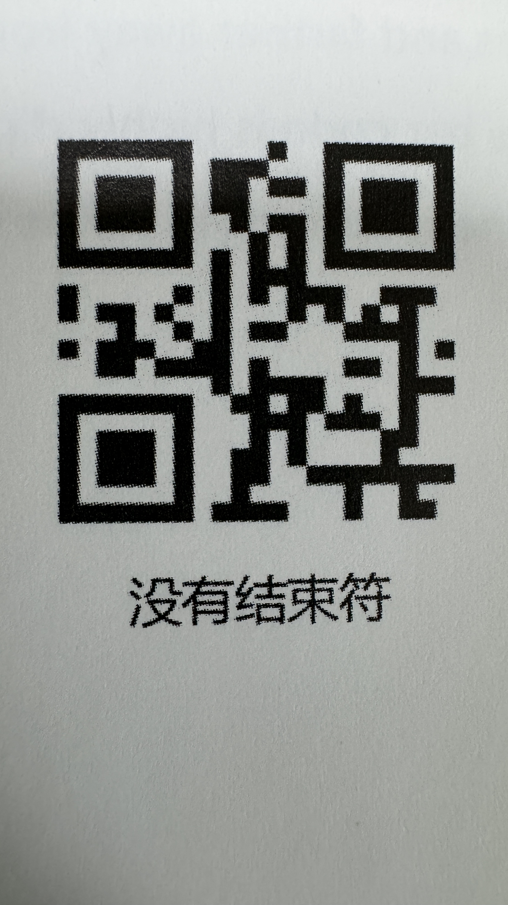

# 📷 ScanHome扫码器

## 配置扫码器

连接扫码器后，听到扫码器启动音效，分别对以下配置二维码进行扫码



<figure><figcaption></figcaption></figure>



<figure><figcaption></figcaption></figure>



<figure><figcaption></figcaption></figure>



## 下载脚本





## Mac下运行脚本

1. install hidapi: `brew install hidapi`&#x20;
2. install hidapi module: `python3 -m pip install hidapi`
3. run script: `sudo python3 main.py`
4. 对任意条码进行扫码，脚本输出如下：

```bash
> sudo python3 main.py
Password:
Manufacturer: SM
Product: SM-2D PRODUCT HID KBW
Serial No: APP-000000000
Read the data
len: 13
4902505337611
^CCtrl+C captured, ending read.
```
