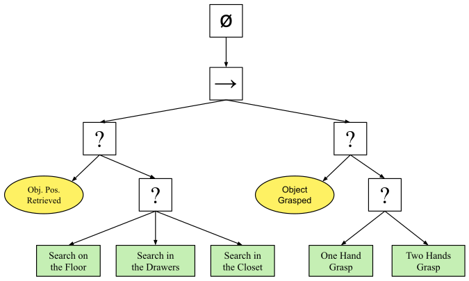

# 🌲 Behavior tree


Behavior trees present some similarities to <mark style="color:yellow;">hierarchical state machines</mark> with the key difference that the main building block of a behavior is a <mark style="color:yellow;">task</mark> rather than a state.


Nodes are classified as root, control flow nodes, or execution nodes (tasks).

When the execution of a node in the behavior tree is allowed, it returns to the parent a status <mark style="color:yellow;">**running**</mark> if its execution has not finished yet, <mark style="color:yellow;">**success**</mark> if it has achieved its goal, or <mark style="color:yellow;">**failure**</mark> otherwise.

<figure><figcaption><p>BT_search_and_grasp</p></figcaption></figure>

## Key concepts

### Control flow node

* It may be either a selector (fallback) node or a sequence node.
* When a subtask is completed and returns its status, the control flow node decides whether to execute the next subtask or not.

#### Selector (fallback) node

* It is used to find and execute the first child that does not fail.
* It will return with a status code of success or running immediately when one of its children returns success or running.
* The children are ticked in order of importance, from left to right.


```python
for i from 1 to n do
    childstatus ← Tick(child(i))
    if childstatus = running
        return running
    else if childstatus = success # << success is critical
        return success
end
return failure
```


#### Sequence node

* It is used to find and execute the first child that has not yet succeeded.
* It will return with a status code of failure or running immediately when one of its children returns failure or running.
* The children are ticked in order, from left to right.


```python
for i from 1 to n do
    childstatus ← Tick(child(i))
    if childstatus = running
        return running
    else if childstatus = failure # << failure is critical
        return failure
end
return failure
```


